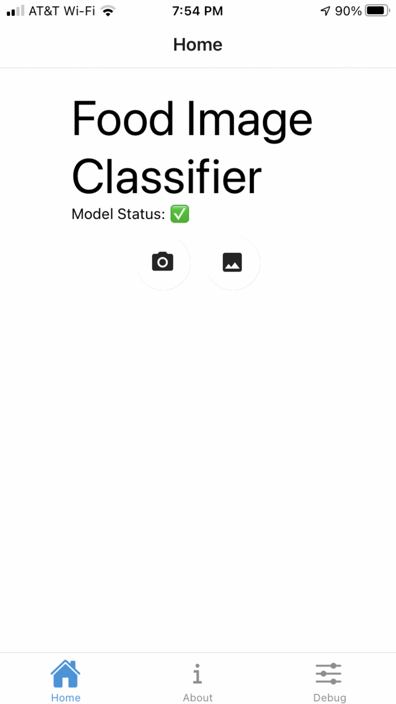

# deploying-mobile-app


## About

In this repository provides a MobileNetV2 deep learning model with pre-trained ImageNet weights and fine tuned on Food 101 dataset as a food image classifier. It is TensorFlow.js converted and deployed in a mobile app using React Native.


## Set up of the repo

A tfjs model is placed in `assets/model_tfjs`

```
(base) deploying-mobile-app % tree assets/model_tfjs
assets/model_tfjs
├── classes.json
├── classes.txt
├── group1-shard1of1.bin
└── model.json
```

Conver a tensorflow keras h5 into tfjs format with

`artifacts/model_tf_keras.h5` to  tfjs and saves it to `artifacts/model_tfjs`.

The model is also 16 bit quanitzed.   
The model is converted to `tfjs_graph_model` which is an optimized version of the graph.
The model is broken into 100MB shards.

```
pip install tensorflowjs==2.4.0

tensorflowjs_converter \
--input_format=keras \
--output_format=tfjs_graph_model \
--split_weights_by_layer \
--weight_shard_size_bytes=50000000 \
--quantize_float16=* \
artifacts/model_tf_keras.h5 artifacts/model_tfjs
```


## Running the mobile app


```
# install project dependencies with yarn
yarn global add expo-cli    

# you can open iOS, Android, or web from here, or run them directly with the commands below.
yarn start

# you can open in android simulator or device driectly
yarn android

# you can open in ios simulator or device directly
yarn ios


```
Start the app
Open the Expo app on your phone.
You will see your project listed under "Recently in Development". Select it.
In the mobile app at the top, you will see "Model Loaded". Once a green checkmark appears, you are ready to test an image.


Here is the app in action.




## App structure

The app is composed of two screens, Home and About.

The code for the Home screen is defined in HomeScreen.tsx.

The Home screen contains logic for image selection, display prediction, and timing information. The core inferencing logic is delegated to ModelService.tsx.

The code for the About screen is defined in AboutScreen.tsx.

The AboutScreen.tsx renders a simple markdown file defined in config.tsx. Edit this config file to update the info displayed on the screen and other parameters used in the app such as image size, number of predictions, precision of the probability, and title.

The core inferencing logic is defined in ModelService.tsx in components folder.
